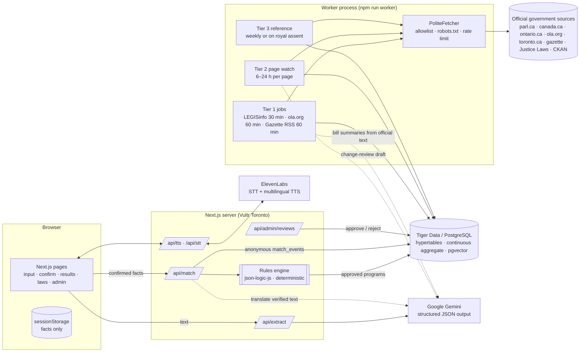
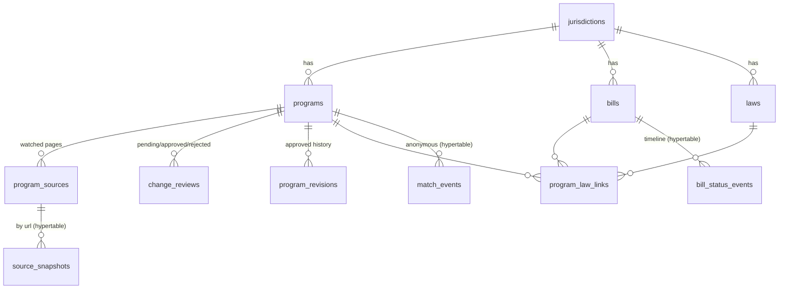

# Benefit Bridge: architecture

## 1. System diagram



**The LLM never decides eligibility.** It has four jobs, each with a strict JSON contract
(section 5):
1. extract facts from the user's words
2. translate already-verified text
3. summarize official text
4. draft change summaries for human reviewers

## 2. The three freshness tiers

| Tier | What | How | Human in the loop? | Code |
|---|---|---|---|---|
| **1: real-time** | Bill status (federal and Ontario), Gazette II/III | LEGISinfo JSON every 30 min; ola.org scrape every 60 min; RSS every 60 min. Each stage change becomes a row in `bill_status_events`. The Parliament and session are **detected from the data**. | No. Status changes are applied automatically. | `lib/ingest/legisinfo.ts`, `ontario-bills.ts`, `gazette.ts`, `worker/jobs.ts` |
| **2: near-real-time, approved** | Program eligibility, amounts, deadlines | Each watched page is fetched every 6–24 h. We extract `<main>` and the page's **Date modified**, normalize the text and hash it. A changed hash triggers a snapshot, a unified diff, an LLM draft and a **pending review**. A 404/410, or 2 consecutive failures, sets the program to `needs_verification`. | **Yes.** Live rules change only when `/admin` approves. | `lib/ingest/page-extract.ts`, `page-watch.ts`, `lib/db/reviews.ts` |
| **3: reference** | Consolidated Acts (Justice Laws XML), Ontario e-Laws, CKAN datasets | Weekly refresh, plus an immediate refresh when Tier 1 sees a new royal assent. Stores `current_to`, `last_amended_on` and a content hash. | Law "what changed" text: yes | `worker/jobs.ts#referenceLawsJob` |

Freshness is visible to users on every program card:

- **Last verified:** when a human last approved the program.
- **Source last changed:** the official page's own "Date modified".
- **Warning banners:** `needs_verification` or not yet verified (warning), more than 30 days since verification (warning, "may be out of date"), and a pending review (info).

## 3. Data model



The full DDL is in `db/migrations/001_init.sql`. It follows the spec, with these additions:

- `jurisdictions`: makes a new province or city a data change.
- `program_sources`: a program depends on several pages.
- `program_revisions`: immutable audit trail of approved rules.
- `gazette_items`, `reference_datasets`, `job_runs`, `saved_results`.

**Tiger Data features** (`002_timescale.sql`, applied only when the extension exists):

- hypertables on `source_snapshots(fetched_at)`, `bill_status_events(occurred_at)` and `match_events(matched_at)`
- a `match_daily` continuous aggregate with an hourly refresh policy
- 13-month retention on raw `match_events`

`003_pgvector.sql` adds `program_embeddings vector(768)` with an HNSW index. On plain
Postgres, `900_fallback_views.sql` replaces the continuous aggregate with a plain view.

**Traceability:** every fact keeps its `source_url`:

- criteria have `source_url` and `source_quote`
- amounts and deadlines have their own `source_url`
- snapshots keep `fetched_at` and `content_hash`
- bills keep `content_hash` and `raw`

## 4. Rules engine

Rules are **JSON Logic per criterion**, evaluated server-side by `json-logic-js` (`lib/rules/engine.ts`).

```jsonc
{ "id": "income_under_90k",
  "logic": { "<": [ { "var": "family_income" }, 90000 ] },
  "applies_if": null,
  "met":    { "en": "Your family income is under $90,000", "fr": "…" },
  "failed": { "en": "Adjusted family net income must be less than $90,000", "fr": "…" },
  "check":  { "en": "Check whether …", "fr": "…" },
  "source_url": "https://www.canada.ca/…/dental-care-plan/qualify.html",
  "source_quote": "your adjusted family net income must be less than $90,000" }
```

**Tri-state evaluation (no guessing):**

1. **Unknown facts.** If any variable the logic references is unknown (`null`), the result is `unknown` and the engine records which raw facts are missing. This is essential: `json-logic-js` alone evaluates `undefined < 90000` as **true**.
2. **Ranges.** Income is a band, never a number. Range variables are evaluated at **both ends**. Same answer at both ends: definite. Different answers: uncertain, and the user is told to check the official page. Rules must be monotonic in range variables; plain thresholds are.
3. **Data gaps.** A rule may deliberately return `null`. That means the verified database has no rule for this situation, for example Fair Pass for household size 3. The user sees "check the official page".
4. **Conditional criteria.** `applies_if` gates a criterion. Example: the CCB 18-month rule applies only to temporary residents. If the gate is false, the criterion is `not_applicable`.
5. **Residence.** Residence criteria are generated from the program's `jurisdiction` (province, municipality). Adding Toronto boroughs or another city is data (`cityAliases`).

**Aggregation:**
- any failed criterion → **Not eligible because Y**
- otherwise, any unknown or data gap → **Possibly eligible: check X**
- otherwise → **Likely eligible**

**Follow-up questions** are computed deterministically. They cover only the unknown facts
that appear in programs not already ruled out, ranked by how many programs they affect,
at most 3.

**Validation of reviewer edits** (`lib/rules/validate.ts`) rejects:
- unknown variables (a typo would otherwise make a criterion permanently "unknown")
- non-government citations
- invalid JSON Logic

**Personas** are fixed fact sets (`data/personas.ts`) run through the **same engine and
data**. They are always labelled "illustrative example", and no LLM is involved.

## 5. LLM prompt contracts

All contracts live in `lib/llm/contracts.ts`. Gemini gets `responseMimeType:
application/json` plus `responseJsonSchema`. Every response is **re-validated with zod**.
Invalid output is retried once, then rejected (HTTP 502), never passed on.

### 5.1 Fact extraction: `POST /api/extract`
Input: `{ "text": string (≤ 2000 chars) }`.

Before the text is sent:
- SIN-shaped numbers and long document numbers are removed
- the text is wrapped as quoted data (prompt-injection hardening)

Output:
```jsonc
{ "detected_language": "es",
  "facts": { "province": "ON"|…|null, "city": string|null, "age": int|null, "has_partner": bool|null,
             "children_ages": int[]|null, "household_size": int|null,
             "family_income_band": "under_15k"|"15k_25k"|…|"over_150k"|null,
             "residency_status": "citizen"|"permanent_resident"|"protected_person"|"refugee_claimant"|
                                 "temporary_worker"|"temporary_student"|"visitor"|"other"|null,
             "years_in_canada": number|null, "employment_status": …|null, "disability": bool|null,
             "student_status": …|null, "has_dental_insurance": bool|null, "housing": …|null,
             "receives_social_assistance": bool|null },
  "evidence": [ { "fact": "age", "quote": "Tengo 24 años" } ],
  "sensitive_data_ignored": bool,
  "rejected_values": ["province"] }   // added server-side: invalid values set to null
```
Post-processing: each field is validated individually, and invalid values become `null`.
A consistency guard rejects a `household_size` smaller than person + partner + children.

### 5.2 Translation (used by `/api/match` for languages other than en/fr)
Input: `{ texts: string[], target_language }`. Output: `{ translations: string[] }` (same
length, enforced). The rule: faithful translation with numbers, dates, URLs and program
names unchanged. Results are labelled "translated automatically; English/French versions are
the reference".

### 5.3 Summary of official text (bills, programs)
Input: source text + URL + output language + `kind` + royal-assent flag.
Output: `{ summary, who_is_affected[], what_changed|null, coming_into_force|null, unsupported_claims[] }`.
Rules:
- use only the source text
- write at a Grade 6 reading level
- use the conditional mood ("would") before royal assent
- `coming_into_force` is null unless the source states it

### 5.4 Change-review draft (reviewers only, never public)
Input: the current program record + unified diff.
Output: `{ summary, affected_fields[], evidence_quotes[], suggested_rule_changes|null, risk: low|medium|high, cosmetic_only }`.

## 6. Privacy and security

- **No raw text or audio is stored or logged.** `/api/extract` and `/api/stt` process
  input in memory.
- **Client state lives in `sessionStorage`** and disappears when the tab closes.
- **`match_events` holds only:** `program_id`, the jurisdiction-level region, the
  confidence and a timestamp. The dashboard suppresses counts under 10.
- **Opt-in saved results** store only the structured facts, encrypted with AES-256-GCM,
  keyed to the Auth0 subject. They can be deleted at any time (`DELETE /api/saved`).
- **Admin access** requires Auth0 passwordless sign-in plus `ADMIN_EMAILS`. The dev-only
  `ADMIN_TOKEN` is ignored in production.
- **Paid APIs** are rate-limited per IP.
- **Fetching** is restricted to the domain allowlist. A redirect off the allowlist is a
  failure. robots.txt and Crawl-delay are honoured.

## 7. Accessibility

- **Semantics:** landmarks, a skip link, labelled form controls, `fieldset`/`legend` for
  choices, and `aria-live` for async status.
- **Interaction:** 44 px minimum targets, a visible 3 px focus ring, and colour plus
  icon/text for confidence (never colour alone).
- **Honouring user settings:** `prefers-reduced-motion`, a dark mode with AA contrast, and
  print styles for the checklist.
- **Automated testing:** axe-core (WCAG 2.0/2.1/2.2 A+AA tags) ran on all 9 main views at
  390 px width with **0 violations**.
- **Not yet done:** manual screen-reader testing with NVDA/VoiceOver. Do this before launch.
